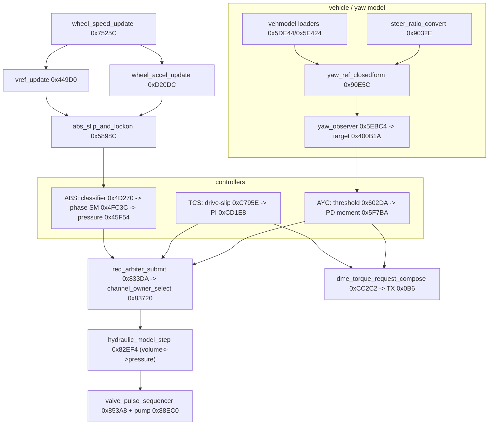

# MK60E5 E9x M3 (7846816A) — firmware architecture

Top-down map of the M3 DSC application, tying together the six RE cycles. Companion to the
parameter-level `docs/HANDBOOK.md` and the 1M-focused `ARCHITECTURE.md`. Confidence follows
`FACTS.md`: anything not **[verified]** there is an inference. CPU addresses (file offset = CPU + 0x8000).

The M3 is the **same platform as the 1M, relocated**. Established shift map:

| Region | M3 = 1M + | | Region | M3 = 1M + |
|---|---|---|---|---|
| OS code 0x42xxx | −0x220 | | code 0x96xxx–0xC0xxx | +0x218 |
| app/wrapper 0x70xxx | −0x5C | | dispatcher 0x8Cxxx | +0x1E0 |
| ABS 0x44–0x5A (<0x4C) | −0x220 | | ABS ≥0x4C000 | −0x200 |
| reset/startup 0x6Cxxx | −0xAC | | ROM data / tables | −0x308 |
| ROM objects 0xD7xxx | −0x390 | | diag/fault RAM | +0x24 |

Coding/calibration RAM (`0x4031xx`, `0x4020xx`) is **unshifted**.

## Hardware view

```
  wheel sensors (VDA 7/14/28 mA) --> sensor+valve ASIC (QSPI CS5) --+
       speed pulses --> timer/capture D8 (w1,w2) + F8 (w0,w3) IRQ 56-59
  PT-CAN <--> CAN 0xDD0000 (32 mailboxes) <--> M-CORE MCU (Freescale SC560002, custom)
  F-CAN <--> CAN 0xFA0000                     INTC 0xE10000, VBR 0x40000, RAM 0x400000..
  coding EEPROM <-- QSPI 0xDB0000 CS2 ;  digital-valve latch CS4 ;  pump motor = timer-PWM 0xF80000
```

**Update 2026-10-06:** the wheel-sensor channels are not VDA-only. ASIC register **0x28C** is a per-channel VDA/2-level mode mask
(stock 0x00F). The timer capture edge is set per channel by `sub_0D569C(ch, mode)` (0x91 = single edge,
0xA1 = both edges). The E46 sensor patch uses both: `docs/E46_SENSOR_FIRMWARE_PATCH.md`.

- MCU: Freescale **SC560002MVF92** (custom M·CORE ABS IC, no public datasheet). 80 MHz inferred; 1 µs timer tick.
- Reset handler **0x6C906**; app CPU range 0x40000–0xF6A23; vector table at 0x40000 (128 × u32).
- Valve actuation: 12 solenoid channels — ch0-3 inlet (analog current via CS5 ASIC `asic_reg_xfer32` 0xD4A30),
  ch4-7 outlet (digital via CS4 latch 0xD4BF4), ch8-11 USV/HSV (roles inferred). Return pump is a timer-PWM.

## Software layers

```
+------------------------------------------------------------------------------------------+
| Control & monitoring  (once per 10 ms frame, task T3 body 0x70FE4)                       |
|   0x7525C wheel speed -> estimators -> control_dispatcher 0x8CCB8 (flat 41-call sequence) |
|     ABS core 0x44000-0x5B000 | TCS 0xC7800-0xD000 | AYC/yaw 0x5EBC4..  | DDS/RPA 0xA623A  |
|   -> monitoring_main 0xB3FC0 -> CAN stacks -> diagnostics -> NVM/fault manager 0xB427C    |
| Fast loops: T1 0x70BFC (4/frame)  T2 0x70C58 (10/frame, SPI/valve engine)                 |
+------------------------------------------------------------------------------------------+
| Services: PT-CAN tables 0xD7F45 | F-CAN 0xF59C3 | KWP2000 0xF30A0 | coding 0xCFC00/0x8E25E |
+------------------------------------------------------------------------------------------+
| Runtime wrapper 0x77xxx: ROM object 0xD7B84 -> 5 objects -> OS tasks                      |
| OSEK OS 0x42000-0x44000: 5 tasks, events, scheduler 0x42B84 (IRQ 32)                       |
| Time base: vec60 -> isr_timeslot 0x70A2A, 13-slot 10 ms frame, jump table 0x70ACC         |
| Startup: reset 0x6C906 -> RAM clear, PLL 0x6C6D8, VBR, INTC, timers (prescale 79)          |
| Bootloader (file 0x0-0x47FFF): NOT in the .0pa; BMY signature check presumably there      |
+------------------------------------------------------------------------------------------+
```

## The 10 ms control pipeline

The main cycle (T3, `0x70FE4`) runs the control dispatcher `0x8CCB8` — a flat sequence of 41 `jsri`
calls (not a jump table). In pipeline order:



### Estimation
- **vref** `0x408DA8` — rate-limited integrator (`vref_update` 0x449D0), from the 4 filtered wheel speeds ×
  per-wheel tyre-circumference (BFU block 0x41CE4).
- **wheel accel** — `wheel_accel_update` 0xD20DC, two-frame mean ×2.833 (literal 0xE287), 0.01 g.
- **slip** — `ref − wheel speed` per wheel; slip ratio 0x408F84.
- **vehicle/yaw model** — single-track, variant-indexed scalars (0xD6F42.. loaded to RAM 0x400AA4..); v_ch
  runtime-derived (105–142 km/h); target yaw 0x400B1A from `yaw_observer` 0x5EBC4 + closed-form `0x90E5C`.

### Decision
- **ABS** — `abs_event_classifier` 0x4D270 builds per-wheel thresholds (gross-slip arming curve 0xD6CE2,
  decel threshold builder 0x47BDC); `abs_phase_sm` 0x4FC3C cycles 0x80→0x21 dump→0x09 hold→0x11 reapply;
  decision code 0x408DDE classifies the control (`abs_decision_classify` 0x51B54).
- **TCS** — rear drive-slip vs target (`tcs_driveslip_curve` 0xC795E), PI torque-reduction loop 0xCD1E8.
- **AYC** — yaw error vs per-mode entry threshold (`ayc_threshold_stage` 0x602DA), PD moment 0x5F7BA; DSC mode
  m∈{0,1,2} (`dsc_mode_select` 0xCF2EA) scales thresholds/ceilings. m1 is the most permissive.

### Arbitration & actuation
- Each controller submits a per-wheel pressure request via `req_arbiter_submit` 0x833DA;
  `channel_owner_select` 0x83720 resolves priority (18>5>4>6>8>1>2>3>14>13>0>11>12>17>20>16).
- **Wheel pressure PM (0x4016E2) is measured**: the four wheel-output transducers (`0x402198[w]`) overwrite PM
  every 10 ms (`sub_082BC0`) and are broadcast on CAN 0x2B2. `hydraulic_model_step` 0x82EF4 also tracks wheel
  volume V through the COA p↔V curves (valve flow Q = √Δp·open·k/4096); that model sizes valve pulses and stands
  in for PM during dump phases or a wheel-sensor fault. ABS submits CMD/RAMP/UP only; it never writes the model
  (PM is copied back by `abs_pm_snapshot` 0x559CC).
- `valve_pulse_sequencer` 0x853A8 builds 10-step inlet-current profiles; pump via `pump_motor_control` 0x88EC0.
- **Engine torque**: TCS/MSR/AYC requests merge in `dme_torque_request_compose` 0xCC2C2 → **CAN TX 0x0B6** to the DME.

## External interfaces

- **PT-CAN** 0xD7F45 (20 TX / 27 RX). Live inputs: DME torque 0x0A8/0x0A9/0x0AA, gear 0x0BA, CAS 0x130, tester
  0x6F1, NM node 0x29 (0x480). Outputs: wheel speed 0x0CE, vehicle speed/accel 0x1A0, status/lamp 0x19E, torque
  request 0x0B6. All TX carry a checksum (Σ+CAN-id) + alive counter.
- **F-CAN** 0xF59C3 (14 TX / 18 RX). Live: steering 0x0C9, yaw/lat-g cluster 0x0CD/0x0D1/0x0D4. The DSC gateways
  0x0C8/0x194/0x1D6/0x2A6/0x1D9 onto PT-CAN. The aux torque-limit exchange (0x78F/0x78E) is disabled (cal 0x4182A=0).
- **Diagnostics**: KWP2000 table 0xF30A0 (23 SIDs); SecurityAccess 0x27 seed = `(u16@0x40095C) XOR 0x1B09`
  (ECU "AZ1RAE00008"); coding via `coding_field_read` 0xCFC00 / `coding_field_read_geom` 0x8E25E → RAM 0x4031F4.
  Warning-lamp state is broadcast on CAN only — no GPIO lamp output.

## Integrity & re-signing

Two layers must be recomputed after a calibration edit (tooled in `tools/bmy_resign.py`):

1. **ROM self-test (MISR)** — table 0xD71F4, three ranges; calibration range `[0x40300, 0x4249C)` with the
   expected word stored at 0x4249C (poly 0x00400007, seed 0, BE words). Error 0x10004 on mismatch.
2. **BMY signature** — 512-bit RSA (e=7) over the application region, trailing `BMY` block; private key in
   `rsa-sig.json`. Computed after the MISR fix (which is inside the hashed region).

`bmy_resign.py fix <bin>` does both; `verify` reports MISR OK / BMY VALID. The bootloader (absent 0x0–0x47FFF)
presumably enforces the signature at flash time, so edited images are research-only.

## M3 vs 1M — what actually differs

Most of the image is the 1M relocated. The genuine M3-specific content:

| Area | Difference |
|---|---|
| Vehicle model | 12-variant table by body/model (sedan, coupe, convertible, their Competition twins, GTS coupe/sedan, Custom ESM; 1M is a single scalar set); v_ch higher (105–142 vs 97.65 km/h) |
| ABS cal block | 12-way variant duplication of speed/g-term curves; variants 10/11 (GTS coupe/sedan) more permissive at high speed; builder 0x47BDC rewritten; one scalar at 0x4063E |
| TCS | large curves relocated to const ROM 0xF61xx; gross-slip limit + entry gates hard-coded (cal on 1M) |
| CSI / steering | block grew (+0x62); steering-ratio curve changed (15.9→12.6 vs 14.6→12.5) |
| LVC | one scalar (0x4226A = 75 vs 50) |
| AYC / slip / decel / brake / DDS / FSF | **byte-identical** to the 1M |

**Conclusion:** the M-car is not meaningfully more permissive in the core slip/decel targets. Its character lives
in the **DSC-mode logic** — which AYC mode (m1 vs m2, by coding bit) is active, and the per-mode torque ceiling
(m1 = 2000) — not in the ABS/TCS calibration numbers.

---
*Function-level detail: `analysis/7846816A_symbols.md`. Field-level facts: `FACTS.md`. Tunable parameters:
`docs/HANDBOOK.md` / `.pdf` and `xdf/MK60E5_7846816A.xdf`.*
