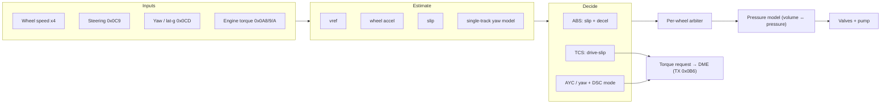
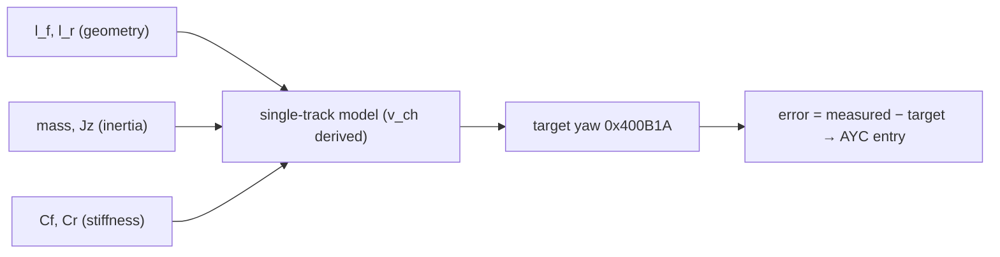
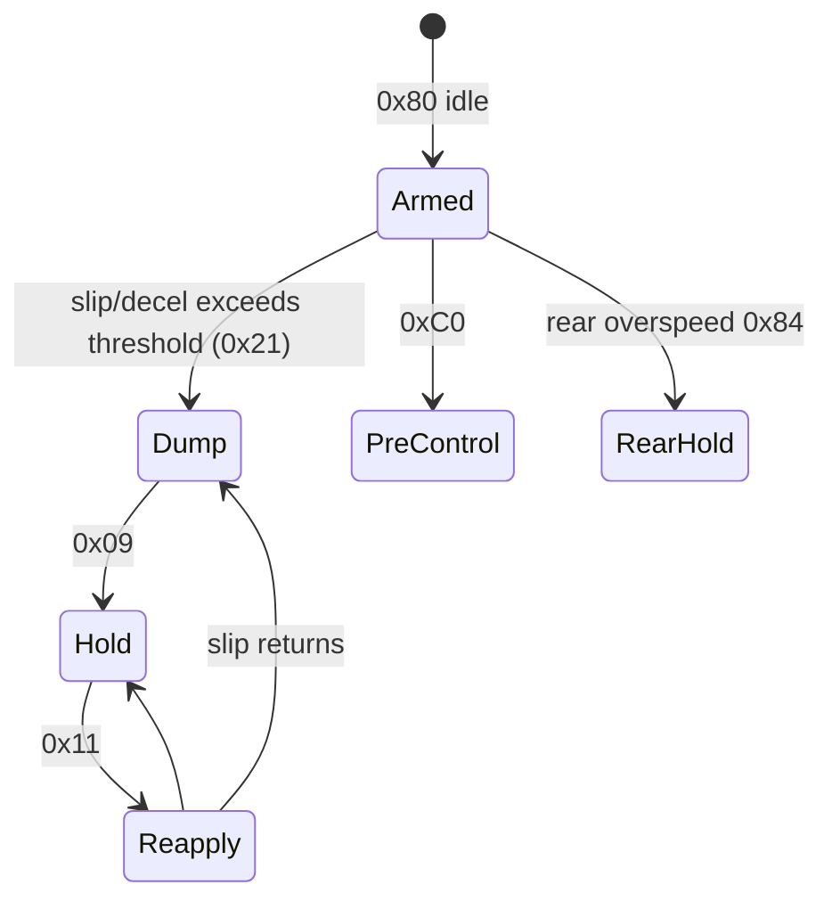
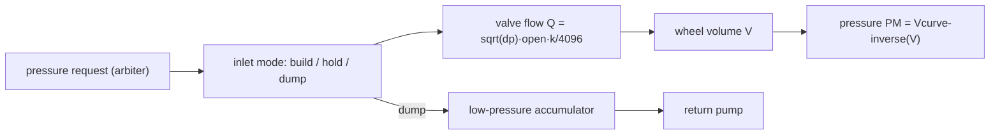
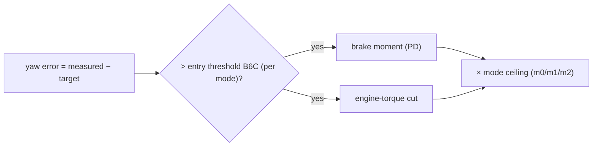

# MK60E5 DSC Calibration Handbook — E9x M3 (7846816A)

What each calibration parameter in the M3 stability-control firmware actually changes, grouped by
subsystem, with the algorithm it feeds and the direction of its effect.

- **Image:** `7846816A` (DSCM90), 1 MiB. CPU: Freescale **M·CORE**, big-endian. Control frame: **10 ms**.
- **Addressing:** everything below is a **CPU address**; file offset in the `.bin` = CPU + `0x8000`.
- **Maps to:** `xdf/MK60E5_7846816A.xdf` (TunerPro) · symbols `analysis/7846816A_symbols.md` · facts `FACTS.md`.
- **Status:** all values byte-verified against the image unless marked *med*/*low*.

> **Scope.** This is static analysis of the owner's own ECU, for understanding and comparison. Stock
> values are quoted so edits are legible against a baseline. It is **not** a recipe for disabling the
> safety system on a road car: the most consequential levers (DSC mode, the active coding variant) live
> in EEPROM, not the flash, and every edited image must be re-signed to load (see *Editing & re-signing*).

---

## How to read a parameter

Each table gives the parameter, its address, the stock value, and **what happens if you raise it**. Two
tags carry most of the meaning:

| Tag | Meaning |
|---|---|
| **CAL** | Lives in a calibration block — editable, covered by the re-sign step. |
| **CODE** | A literal baked into the code — changing it means a code patch, not a calibration edit. |
| **EEPROM** | Lives in the unit's coding/EEPROM, not the flash — set by coding, not recoverable from the image. |

Unit conventions:

| Convention | Meaning |
|---|---|
| `0.01 km/h` | Speeds and slip stored ×100. `5000` = 50.00 km/h. |
| `0.01 g` | Decelerations stored ×100, signed. `-116` ≈ −1.16 g *(unit unproven)*. |
| `Q10` | Fixed-point: value ÷ 1024. Used for lengths (metres) and curve slopes. |
| `~0.01 bar` | Modelled brake pressure. Consistent with the evidence, not pinned to a sensor *(unproven)*. |
| `variant 0–11` | A 5-bit EEPROM field (`0x4031AA+1`) selects one column of the 12-wide model tables. Only 7 are distinct (0–4 repeat as 5–9; 10/11 unique). |
| `curve` | Piecewise-linear table `(lo, hi, n, breakpoints, intercepts, slopes)` read by the interpolator at `0x710FC`: `out = clamp(intercept + input·slope/1024, lo, hi)`. |

---

## Architecture

Once per 10 ms frame the main task (T3, body `0x70FE4`) walks a fixed 41-call sequence: read sensors,
estimate vehicle state, let each controller decide what it wants, arbitrate per wheel, run the pressure
model, drive the valves, and send a torque request back to the engine.



The parameter groups below sit at these stages: *vehicle model* and *steering* feed estimation; *ABS*,
*TCS*, *AYC* are the controllers; *pressure & hydraulics* is the model and actuator.

---

## Editing & re-signing

An edited image is rejected until two integrity values are recomputed. Both are solved and tooled.

| Layer | What | Fix |
|---|---|---|
| **ROM self-test** | A hardware MISR over three regions; the calibration region is `[0x40300, 0x4249C)` with its expected word stored at `0x4249C`. | Recompute after any cal edit. |
| **BMY signature** | A 512-bit RSA signature (e=7) over the application, in the trailing `BMY` block. Private key recovered (`rsa-sig.json`). | Re-sign after the MISR fix (it is inside the hashed region). |

```
python tools/bmy_resign.py fix <edited.bin>      # MISR words, then BMY signature
python tools/bmy_resign.py verify <bin>          # reports MISR OK / BMY VALID
```

On stock, `verify` reads all three MISR OK and BMY VALID. Whether the bootloader enforces the signature
at flash time is in the absent `0x0–0x47FFF` region, so treat edited images as **research-only**.

---

## Vehicle model

The yaw controller runs a bicycle (single-track) model of the car. These scalars are its physical
constants, stored as **12 columns — one per coding variant** — loaded into RAM by `0x5DE44`/`0x5E424`.
They set how much yaw the car *should* make for a given steering and speed; the controller acts on the
error between that and the measured yaw.



| Parameter | Addr | Stock | Raise it → | Tag · Conf |
|---|---|---|---|---|
| l_f front axle→CG | `0xD6F42` | 1413 (Q10 m) | CG treated as further forward; shifts understeer balance | CAL · high |
| l_r CG→rear axle | `0xD6F5A` | 1413 (Q10 m) | l_f+l_r = wheelbase 2.760 m (fixed); trades balance with l_f | CAL · high |
| mass | `0xD6F72` | 1787 kg | Model assumes a heavier car: larger yaw-moment demand | CAL · high |
| Jz yaw inertia | `0xD6F8A` | 2999 kg·m² | Model expects slower rotation → reacts earlier to yaw build-up | CAL · high |
| Cf front stiffness | `0xD6ECA` | 7527 | More assumed front grip; lowers v_ch | CAL · med-units |
| Cr rear stiffness | `0xD6EE2` | 10596 | More assumed rear grip; Cr>Cf keeps the model understeering | CAL · med-units |
| v_ch characteristic speed | *derived* | 105–142 km/h | **Not stored** — computed from the above. Higher = flatter yaw gain with speed = less yaw demanded at speed. M3 runs higher than the 1M. | DERIVED · med |
| track front / rear | `0xD6FA2`/`BA` | 1.538 / 1.536 m | Track geometry — **Q10 metres** (= the real M3 track), not mm | CAL · med |
| active variant | `0x4031AA+1` | EEPROM | Selects *which column* of all the above is used | EEPROM · high |

---

## Wheel speed & tyres

The four wheel speeds are the root of everything — vref, slip, and the broadcast vehicle speed all derive
from them. Tyre circumference is the scale factor. The M3 ships the **same geometry as the 1M**.

| Parameter | Addr | Stock | Raise it → | Tag · Conf |
|---|---|---|---|---|
| circumference front | `0x41CF4` | 2073 mm | ECU reads a **higher road speed** for the same wheel rpm — shifts vref and the speedo. The knob to match a different rolling radius. | CAL · high |
| circumference rear | `0x41CF6` | 2073 mm | Same, rear axle. Front≠rear biases the undriven/driven comparison TCS uses. | CAL · high |
| tooth count F / R | `0x41CF8`/`FA` | 48 / 48 | Encoder teeth per rev; sets the per-edge angle. Must match the physical tone ring. | CAL · high |
| standstill threshold | `0x41CF2` | 72 (0.72 km/h) | Speed below which a wheel counts as stopped. Higher = calls the car stationary sooner. | CAL · high |

> **Sensor type.** Stock M3 and 1M images configure all four channels for VDA active (encoded) sensors. There is no
> coding or calibration selector. **E46-type 2-level (7/14 mA) sensors work with a 4-byte firmware patch**
> (bench-verified on all four wheels, 2026-10-06):
>
> - ASIC sensor-mode mask 0x28C → 0.
> - Both-edge timer capture.
> - Direction mask 0.
> - Presence mode 2.
>
> The tooth count stays 48. See `docs/E46_SENSOR_FIRMWARE_PATCH.md`.

---

## ABS slip & deceleration

ABS arms a wheel when its slip (vref − wheel speed) or its deceleration crosses a speed- and
grip-dependent threshold. The per-wheel **phase state machine** then cycles dump → hold → reapply.



**Key detail (verified):** the arming threshold a wheel is actually tested against is the *gross-slip*
curve at `0xD6CE2` (≈ 4 km/h at low speed, rising to ~11 % of vref) with a persistence counter that
needs ~5 qualifying counts (one cycle above ~50 km/h, three at 20 km/h, never below 10 km/h). The small
`0x40DB6` "entry-slip" curve (1.3–2.0 km/h) is used **only** inside the pair-logic partner test, not as
the primary arming threshold.

| Parameter | Addr | Stock | Raise it → | Tag · Conf |
|---|---|---|---|---|
| gross-slip arming curve | `0xD6CE2` | 400 → ~11 % vref | The slip a wheel must reach to arm ABS. Higher = later ABS, more bite on grip, worse on low-μ. | CODE-ROM · high |
| entry-slip (pair test) | `0x40DB6` | ≈1.3–2.0 km/h | Partner-in-slip test inside pair logic. | CAL · high |
| decel base | `0x40620` | −116 (≈−1.16 g) | Baseline decel threshold. More negative = tolerates harder decel before acting. | CAL · high/unit-med |
| decel floor | `0x4061E` | −240 (≈−2.4 g) | Most-negative limit of the threshold. | CAL · high |
| accel gain F / R | `0x4061A`/`1C` | 40 / 25 | How strongly wheel accel feeds the threshold builder. | CAL · high |
| low-speed floors | `0x40644`/`0x4065C` | 12 cols | Per-variant floors below 20 / 60 km/h. Variants 10/11 are the permissive set. | CAL · high |
| speed-term / g-term curves | `0x40412`/`0x40674` | 12 variant copies | Shape the threshold vs speed and vs g. 0–9 match the 1M; 10/11 differ. | CAL · high |

**Decision code `0x408DDE`** classifies the control action each cycle (`abs_decision_classify` `0x51B54`,
resolved by `0x58B30`): `1` no rear control · `16→8` stepped/select-low rear build · `2` pair-hold
complete · `32` yaw-limited build (0–100 % lag, see AYC) · `256` cornering reapply. (`64`/`128` are
transient within a cycle.)

> **M3 vs 1M.** The core slip and decel targets are **identical** to the 1M for coding variants 1–9. Only
> variants 10/11 are measurably more permissive (high-speed, ≥150 km/h). The M-car's extra licence lives
> in the yaw/DSC-mode logic, not these numbers.

---

## Pressure & hydraulics

The controller does not command pressure directly — it works through a **volume model**. Each wheel's
fluid volume is tracked, converted to pressure through the COA p–V curves, and changed by valve flow
`Q = √Δp · opening · k`. A low-pressure accumulator per circuit holds dumped fluid; a return pump drains it.



| Parameter | Addr | Stock | Raise it → | Tag · Conf |
|---|---|---|---|---|
| apply ramp / cycle | `0x403A8` | 400 | Pressure built per 10 ms during reapply. Higher = faster, harsher re-clamp. | CAL · high |
| dump reductions | `0x40E64` | 1000 / 1500 / 2000 | Pressure released per dump stage. Higher = bigger release, quicker wheel recovery, softer ABS. | CAL · high |
| reapply nudge | `0x40D90` | 80 | Small pressure step entering reapply. | CAL · high |
| k_in build flow F/R | `0x41B26` | 957 / 421 | Inlet-valve flow gain. Higher = pressure builds faster for a given Δp. | CAL · high/unit-med |
| k_out dump flow F/R | `0x41B30` | 755 / 465 | Outlet-valve flow gain. Higher = dumps faster. | CAL · high/unit-med |
| LPA pressure curve | `0x41B16` | 0,130,130,500 | Accumulator model (best clue the unit ≈0.01 bar: 1.3–5.0 bar). | CAL · high |
| pump ramp / gain | `0x41B34`/`36` | 1150 / 100 | Return-pump delivery model. | CAL · med |
| pressure clamps | *code* | −8000 / 25000 | Hard min/max on the pressure request. | CODE · high |
| valve hold/boost current | *code* | 1100 / 1524 / 1532 | Solenoid currents for hold/boost/release steps. | CODE · high |

---

## Traction (TCS)

Traction control acts on the driven (rear) wheels. Drive slip = rear wheel − same-side front, in
0.01 km/h. When it exceeds the target curve, a PI loop requests **engine-torque reduction** and, if
needed, brake pressure. The target set is picked by the DSC mode (0/1/2).

| Parameter | Addr | Stock | Raise it → | Tag · Conf |
|---|---|---|---|---|
| drive-slip target (set B) | `0xF625C` | curve, per mode | Allowed rear-over-front slip before TCS cuts. Higher = **more wheelspin permitted**. Default set. | CAL · high |
| drive-slip target (set A) | `0xF61F6` | curve, per mode | Alternate set, used when the surface/condition flag is set. | CAL · high |
| slip-target scalar | `0x41046` | 2.3 → 10 km/h | Base slip target vs speed inside the controller. | CAL · high |
| PI gains | `0x41072` | 180/100/60/25 | Torque-reduction loop gain schedule. Higher = more aggressive cut for the same slip. | CAL · med |
| PI P / I clamps | `0x41068`/`6E` | ±2500 / ±200 | Limits on the proportional and integral terms. | CAL · med |
| gross-slip limit | *code* | min(1500, 4000−vref) | Hard ceiling — on the M3 a **code literal** (the 1M had it as a cal field). | CODE · high |
| DSC mode index | `0x4031B1` | 0/1/2 (live) | Picks the target column. Derived from DSC-button state + coding. | EEPROM · high |

The torque cut leaves the DSC as **CAN TX 0x0B6** to the DME, scaled ≈÷5 into the engine-torque unit,
merged with the MSR (engine-drag) and AYC requests by one arbiter (`dme_torque_request_compose` `0xCC2C2`).

---

## Yaw control & DSC mode

This is where the M-car's character lives. AYC compares measured yaw to the model target; past the entry
threshold it brakes individual wheels and cuts engine torque. Three DSC modes scale how much it allows —
**mode 1 is by far the most permissive.**



| Parameter | Addr | Stock | Raise it → | Tag · Conf |
|---|---|---|---|---|
| entry threshold base A/B | `0x413BA`/`BC` | 1396 / 2792 = **4.0 / 8.0 deg/s** | Yaw error needed to trigger. Higher = **more yaw/slip-angle allowed before DSC acts**. (yaw LSB 0.0028648 deg/s/count) | CAL · high |
| torque ceiling per mode | `0x4120A` | m0 400 · **m1 2000** · m2 330 | Max engine-torque intervention. m1's 2000 is the permissive mode. Higher = DSC may cut more torque. | CAL · high |
| entry ceiling per mode | `0x41424` | 10471/10471/8028 = 30/30/23 deg/s | Clamp on the entry threshold. m2 is tightest. | CAL · high |
| P-gain % per mode | `0x41460` | 30→100 (m0/1), 70→100 (m2) | How hard the controller pushes once triggered. | CAL · high |
| speed factor per mode | `0x41490`/`F0` | curves ÷128 | Scales the entry threshold with speed. | CAL · high |
| feature enable per mode | `0xD6DA4` | 1 / 0 / 0 | A feature active only in m0 (restricted mode). | CAL · high |
| active DSC mode | `0x4031B1` | live | **Chosen at runtime** from DSC-button state (`0x4030A4`) + one coding bit (`0x4031F4 & 0x80`). | EEPROM · high |

> **Where "MDM" lives.** The AYC tables are byte-identical to the 1M. The M-specific permissiveness is not
> a different number — it is *which mode* the coding bit selects (m1 vs m2) as the driver cycles
> DSC/MDM/off. The slip and decel targets are not the lever; the mode ceilings are.

**How AYC brakes:** past the entry threshold, the PD moment picks one wheel by the sign of the yaw error —
**oversteer brakes the outer front wheel; understeer brakes the same-side rear** (the understeer rear-share is
`0x4155E`, stock rear-only). Pressure is ≈0.1 bar per moment-count. The AYC's engine-torque cap min-merges into
the same `TX 0x0B6` request as TCS. During cornering the ABS and AYC couple through the yaw-limited build
(decision code `32`): the pressure on a rebuilding wheel is held back from its reference by `pct%` of its
partner's deficit — `pct` from the lateral-accel value (`0x408ECA`) between the `0x40E26`/`0x40E0A` curves.

New distribution knobs: understeer rear-share `0x4155E` (256 = rear-only), front-outer pre-fill `0x411B4`
(5 bar), request rate caps `0x41552`/`54` (300/500). The yaw **observer** (`0x5EBC4`) is a nonlinear single-track
model with a per-variant tyre-force knee (friction-limited); its lag curves `0xD704A`/`0xD70AA` are variant-indexed.

---

## Brake coding

Brake hardware is described by pressure↔volume curves, selected by a 3-bit front and 3-bit rear coding
field. Rotor and piston geometry are **not stored as numbers** — they are folded into these curves. The
block bodies are byte-identical to the 1M; coding picks code 0 vs 1 per axle (codes 2–7 undefined).

| Parameter | Addr | Stock | Changes | Tag · Conf |
|---|---|---|---|---|
| p–V pressure axis | `0x41B4E` | 0 … 32700 | Shared breakpoints for the volume curves. | CAL · high |
| front volume set 0/1 | `0x41B62`/`76` | 10-pt curve | Front caliper fluid intake vs pressure — the effective front brake "size". Code `+3` selects. | CAL · high |
| rear volume set 0/1 | `0x41B8A`/`9E` | 10-pt curve | Rear equivalent; code `+4`. | CAL · high |
| BCO thresholds | `0x41764…` | pairs 0/1 | Brake pressure-compare thresholds, per code. | CAL · med |
| brake coding F / R | `0x4031AA+3`/`+4` | EEPROM | Selects which curve set each axle uses. | EEPROM · high |

---

## Steering (CSI)

Steering angle (F-CAN `0x0C9`) is converted to a road-wheel angle through a variable steering-ratio
curve, then fed to the yaw reference. This block is one of the **few genuinely M3-specific calibrations**
— it grew vs the 1M and the ratio curve differs.

| Parameter | Addr | Stock | Raise it → | Tag · Conf |
|---|---|---|---|---|
| steer-ratio curve | `0x40ECC` | 15.9:1 → 12.6:1 | Road-wheel angle per steering angle vs lock. Re-scales the yaw-reference input. | CAL · high |
| ratio breakpoints | `0x40EB4` | 0 … 10880 counts | Steering-angle axis (3 coding-selectable sets). | CAL · high |
| sensor sign tables | `0x40EE4`/`F14` | −1 (all) | Per-variant polarity for the yaw/lat-g channels. | CAL · high |

---

## DDS · LVC · faults

These do not change the handling feel but complete the picture.

| Parameter | Addr | Stock | What it does | Tag · Conf |
|---|---|---|---|---|
| DDS/RPA enable | `0x41D48`/`4A` | 0 (use coding) | Indirect tyre-pressure monitor: a 40-bin wheel-speed **resonance spectrum** (14–151 Hz) watched for a frequency shift vs a learned baseline. Non-zero forces it on. | CAL · high |
| LVC hold count | `0x4226A` | 75 (1M: 50) | The one M3-only scalar in the LVC block — a hold/delay count (~0.75 s vs 0.5 s). | CAL · high |
| CSW wheel reference | `0x41E40` | 1562 | The only live word in CSW — a DDS wheel reference. Rest vestigial. | CAL · high |
| direction fault ids | `0xF576C` | per wheel | DTCs logged for a wheel-direction fault. Warning-lamp state is broadcast on CAN only (no GPIO lamp). | ROM · high |

---

## CAN inputs — what feeds the DSC

The DSC reads engine torque and gear from the powertrain (PT-CAN) and the inertial/steering sensors from
the chassis bus (F-CAN). Sender names are inferred from the IDs; the RAM destinations are verified.

| CAN id (bus) | Sender (inferred) | Quantity | DSC RAM | Status |
|---|---|---|---|---|
| `0x0A8` (PT) | DME | Indicated engine torque | `0x401146` | live |
| `0x0A9` (PT) | DME | Engine-drag / MSR torque (sign-flipped) | `0x401148` | live |
| `0x0AA` (PT) | DME | Driver-demand torque, pedal, RPM | `0x401144`/`42`/`0x40113E` | live |
| `0x0BA` (PT) | EGS / M-DCT | Gear (7-speed table) | `0x4010F7` | live · med |
| `0x130` (PT) | CAS | Terminal / state | `0x4015ED` … | live |
| `0x0C9` (F) | steering sensor | Steering angle | `0x401644` (relayed on TX `0x0C4`) | live |
| `0x0CD`/`0x0D1`/`0x0D4` (F) | DSC sensor cluster | Yaw rate, lateral accel (raw) | `0x402F1C…` | live |
| `0x480` (PT) | NM ring | Network management, node 0x29 | `0x404874` | live |
| `0x6F1` (PT) | diagnostic tester | UDS/KWP | handler `0x7CC02` | live |
| `0x78F`/`0x78E` (F) | aux partner | 14-bit torque limits | `0x404634`/`36` | **disabled** (cal `0x4182A`=0) |
| `0x0AC`,`0x0B4`,`0x0D5`,`0x1B4`,`0x388` (PT); `0x118`,`0x11F` (F) | — | all signals discarded | — | **dead** (stub setters) |

The DSC also acts as a raw **F-CAN→PT-CAN gateway** for `0x0C8`/`0x194`/`0x1D6`/`0x2A6`/`0x1D9`. Every
PT-CAN frame it transmits carries a checksum (`Σ payload + CAN-id`, low byte) and a 0–14 alive counter.

---

## Appendix — key RAM & terms

| Symbol | Address | Meaning |
|---|---|---|
| vref | `0x408DA8` | Reference speed, 0.01 km/h (rate-limited integrator). |
| decision code | `0x408DDE` | Per-cycle ABS control classification. |
| DSC mode | `0x4031B1` | 0/1/2, shared by TCS and AYC (= coding `0x4031AA+7`). |
| coding block | `0x4031AA` | Variant +1, brake front +3 / rear +4, DSC-mode bit via `0x4031F4 & 0x80`. |
| target yaw | `0x400B1A` | Model reference yaw rate. |
| vehicle-model RAM | `0x400AA4…` | Single-track coefficients loaded per variant. |
| modelled pressure PM | `0x4016E2[w]` | Per-wheel pressure from the volume model (~0.01 bar). |
| curve interpolator | `0x710FC` | Reads every `(lo,hi,n,x,c,k)` piecewise-linear table. |

*Addresses are CPU addresses; file offset = CPU + 0x8000. Full function map in
`analysis/7846816A_symbols.md`; exhaustive field data in `FACTS.md` and the XDF.*
